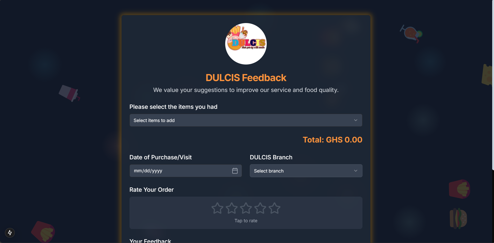

# DULCIS Feedback Form

A modern, interactive feedback form for DULCIS restaurant built with Next.js 13+, TypeScript, and Tailwind CSS. The form features a beautiful UI with animated backgrounds, dark mode support, and a responsive design.



## Features

- 🎨 Modern UI with animated floating icons and ambient lighting effects
- 🌓 Automatic dark mode based on system preferences
- 📱 Fully responsive design for all devices
- 💫 Smooth animations and transitions
- 🔄 Interactive order management system
- ⭐ Star rating system
- 📅 Custom date picker for mobile devices
- 💫 Success and error animations
- 📲 Haptic feedback on mobile devices
- 🌐 PWA ready with manifest.json
- 🔗 Social media integration with X (Twitter), Instagram, and TikTok

## Tech Stack

- [Next.js 13+](https://nextjs.org/) - React framework
- [TypeScript](https://www.typescriptlang.org/) - Type safety
- [Tailwind CSS](https://tailwindcss.com/) - Styling
- [Framer Motion](https://www.framer.com/motion/) - Animations
- [Lucide Icons](https://lucide.dev/) - Icons
- [shadcn/ui](https://ui.shadcn.com/) - UI Components

## Getting Started

1. Clone the repository:

```bash
git clone https://github.com/D3VLABsTechnologies/dulcis.git
```

2. Install dependencies:

```bash
cd dulcis
npm install
```

3. Create a `.env.local` file in the root directory and add your environment variables:

```env
TELEGRAM_TOKEN=your_telegram_bot_token
TELEGRAM_CHAT_ID=your_telegram_chat_id
```

4. Run the development server:

```bash
npm run dev
```

5. Open [http://localhost:3000](http://localhost:3000) with your browser to see the result.

## Project Structure

```
dulcis/
├── src/
│   ├── app/
│   │   ├── api/
│   │   │   └── suggestions/
│   │   │       └── route.js
│   │   ├── layout.tsx
│   │   ├── page.tsx
│   │   └── globals.css
│   ├── components/
│   │   └── ui/
│   └── lib/
├── public/
│   ├── logo.jpg
│   ├── favicon.ico
│   ├── tiktok.svg
│   ├── twitterx.svg
│   └── manifest.json
└── package.json
```

## Deployment

The app can be deployed on [Vercel](https://vercel.com/) with zero configuration:

```bash
npm run build
```

## Contributing

Contributions are welcome! Please feel free to submit a Pull Request.

## License

This project is licensed under the MIT License - see the [LICENSE](LICENSE) file for details.

## Acknowledgments

- UI Components by [shadcn/ui](https://ui.shadcn.com/)
- Icons by [Lucide](https://lucide.dev/)
- Animations powered by [Framer Motion](https://www.framer.com/motion/)

## Contact

For any queries or suggestions, please contact:

- Email: projects@d3vlabs.com
- X (Twitter): [@d3v.labs](https://twitter.com/yourusername)

## Social Media

Follow DULCIS on:

- X (Twitter): [@dulcisgh](https://x.com/dulcisgh)
- Instagram: [@dulcis_gh](https://instagram.com/dulcis_gh)
- TikTok: [@dulcisgh](https://tiktok.com/@dulcisgh)

---

Powered by D3V.LABs &copy; 2024.
